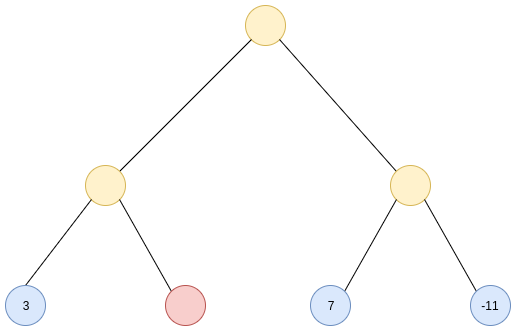

## Algebraic Data Types

<br />
<br />
<br />
> by Giorgi Bagdavadze / @notgiorgi

---

## Product Types

```ts
class Pair<U, V> {
    constructor(
        x: U,
        y: V,
    ) { /*...*/ }
}
```

```haskell
data Pair u v = Pair u v
```

Note: Products of types represent a conjunction, “and,” of those types.

<===>

```ts
class Person {
  constructor(
    name: String,
    age: Number,
    address: String,
  ) { /* ... */ }
}

class Box<T> {
  constructor(private value: T) { }
  /* ... */ 
}
```

```haskell
data Person = Person
  { name    :: String
  , age     :: Int
  , address :: String
  }

data Box a = Box a
```

<===>

## Intiution of haskell

```ts
class Pair<U, V> {
    constructor(/* .. */) {}
}

let pair = new Pair<Boolean, String>(false, "Foo")
```

```haskell
data Pair u v = Pair u v
--   ^ Type     ^ Constructor

-- Type
pair :: Pair Bool String
-- Value
pair = Pair False "Foo"
```

<===>

### Why Algebraic? Why Product?

<===>

### Symmetrical

```
a * b == b * a
```

```ts
Pair<Boolean, String> ~~ Pair<String, Boolean>
```

```haskell
Pair Bool String ~~ Pair String Bool
```

Note: You could say, this is a mathematical proof, that the order you define members of your data structure in, doesn’t matter.

<===>

### Isomorphism

```ts
function swap<U, V>(pair: Pair<U, V>): Pair<V, U> {
  return new Pair<V, U>(pair.y, pair.x)  
}
```

<===>

### Associative

```
a * (b * c) == (a * b) * c == a * b * c
```

```csharp
Pair<bool, Pair<int, string>>
~~
Pair<Pair<bool, int>, string> 
~~
Triplet<bool, int, string>
```

```
Pair Bool (Pair Int String) ~~ Pair (Pair Bool Int) String
```

<===>

### Identity

```
a * 1 == a == 1 * a
```

```ts
Pair<Boolean, Unit> ~~ Boolean
```


```haskell
data Unit = Unit

Pair Bool Unit ~~ Bool
```

Note: Describe Unit

---

## Sum (Union) Types

```ts
enum PromiseState = {
  Pending,
  Fulfilled,
  Rejected,
}
```

```haskell
data PromiseState = Pending | Fulfilled | Rejected
```

<===>

## More than just enums

```ts
interface Optional<T> {/* ... */}
class Some<T> implements Optional<T> {/* .. */}
class None<T> implements Optional<T> {/* ... */}

interface List<T> {/* ... */}
class Nil<T> implements List<T> {/* ... */}
class Cons<T> implements List<T> {/* ... */}
```

```haskell
data Optional a = Some a | None

data List a = Nil | Cons a (Array a)
```

<===>

```haskell
a + b == b + a
```

```ts
Result<Response, string> ~~ Result<string, Response>
```

```haskell
Result Response String ~~ Result String Response
```

<===>

```
a + (b + c) == (a + b) + c
```

```ts
Result<Result<Err, Ok>, number> ~~ Result<Err, Result<Ok, number>>
```

```haskell
Result (Result Err Ok) Int ~~ Result Err (Result Ok Int)
```

<===>

```
a + 0 = a = 0 + a
```

```ts
class Foo { /* ... */ }

class Bar {
  private Bar() {/* ... */}
}

Result<Foo, Bar> ~~ Foo
```

```haskell
Foo a | Bar Void ~~ Foo a
```

---

## Distributive property

```
a * x + b * x + c * x == x * (a + b + c)
```

```haskell
data Promise u v
  = Pending (Array Listener)
  | Rejected (Array Listener) u
  | Fulfilled (Array Listener) v
```

```haskell
data Promise a b =
  Promise (Array Listener) (
      Pending
    | Rejected a
    | Fulfilled b
  )
```

---

## Expotential


```ts
function f(p: PromiseState): boolean {/* ... */}
```

```haskell
f :: PromiseState -> Bool
```

```
bᵃ
```

<===>

```
aᵇ * aᶜ = aᵇ⁺ᶜ
```

```ts
interface PromiseStates<U, V> {
    /* ... */
    then<W>(
        onFulfill: (value: U) => W,
        onReject: (error: V) => W
    ): W

    // ~~

    then<W>(
      handler: (valueOrError: Result<U, V>) => W
    ): W
}
```

```haskell
Pair (b -> a) (c -> a) ~~ Result b c -> a
```

---

## Declare with Invariants!



<===>

## Declare with Invariants!

```haskell
data Tree
  = Empty
  | Leaf Int
  | Node Tree Tree

depth :: Tree -> Int
depth Empty = 0
depth (Leaf n) = 1
depth (Node l r) = 1 + max (depth l) (depth r)
```

Note: Defining data structure in such a way using only type system, that you cannot construct an instance of that type that violates that invariant

---


<===>

```haskell
type alias Field =
  Field
   { fieldName : String
   , selectionStatus: SelectionStatus
   }

type SelectionStatus
    = Sealed
    | Unselected
    | Selected FieldRequirement

type FieldRequirement
    = Required
    | Optional
```

---

## if (x != null) - Bad

```ts
class Vector {
  /* ... */
  divide(that: Vector): Vector {
    if (that.x !== 0 || that.y !== 0)
      return new Vector(this.x / that.x, thix.y / that.y)
    return null
  }
}

/* ... */
const v3 = v1.divide(v2)
if (v3 !== null) {
  v3.add(/* ... */)
}
```
<===>

## Better

```ts
type Vector = NullVector | FullVector

class FullVector {
  /*...*/
  divide(that: Vector): Vector {
    if (that.x !== 0 || that.y !== 0)
      return new FullVector(this.x / that.x, thix.y / that.y)
    return new NullVector()
  }
}

class NullVector {
  /*...*/
  divide(that: Vector): Vector { return this }
}

const v3 = v1
  .divide(v2)
  .add(v5)
  .render()
```

<===>

## The best

```ts
type Optional<T> = Some<T> | None

class Vector {
  divide(that: Vector): Optional<Vector> {
    if (that.x !== 0 || that.y !== 0)
      return new Some(
        new Vector(this.x / that.x, thix.y / that.y)
      )
    return new None()
  }
}


const v3 = v1
  .divide(v2)
  .chain(v => v.multiply(2))
  .matchCase(
    v => console.log(v.x, v.y),
    () => console.log('Error')
  )
```

---

# Thanks!