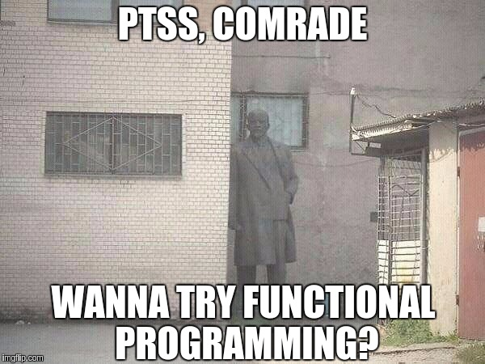

## Algebraic Data Types

<br />
<br />
<br />
> by Giorgi Bagdavadze / @notgiorgi

---

## Disclaimer



---

## Product Types

```ts
class Pair<U, V> {
    constructor(
        x: U,
        y: V,
    ) { /*...*/ }
}

class Person {
  constructor(
    name: String,
    age: Number,
    address: String,
  ) { /* ... */ }
}

class Box<T> { constructor(private value: T) { /* ... */ } }
```

```haskell
data Pair u v = Pair u v

data Person = Person String Int
```

<===>

## Intiution of haskell

```ts
class Pair<U, V> {
    constructor(/* .. */) {}
}

let pair = new Pair<Boolean, String>(false, "Foo")
```

```haskell
data Pair u v = Pair u v
--   ^ Type     ^ Constructor

-- Type
pair :: Pair Bool String
-- Value
pair = Pair False "Foo"
```

<===>

### Why Algebraic? Why Product?

<===>

### Symmetrical

```
a * b == b * a
```

```ts
Pair<Boolean, String> ~~ Pair<String, Boolean>
```

```haskell
Pair Bool String ~~ Pair String Bool
```

<===>

### Isomorphism

```ts
A ~~ B iff (A -> B && B -> A)
```

```ts
function swap<U, V>(pair: Pair<U, V>): Pair<V, U> {
  return new Pair<V, U>(pair.y, pair.x)  
}
```

<===>

### Associative

```
a * (b * c) == (a * b) * c
```

```csharp
Pair<bool, Pair<int, string>> ~~ Pair<Pair<bool, int>, string>
```

```
Pair Bool (Pair Int String) ~~ Pair (Pair Bool Int) String
```

<===>

### Identity

```
a * 1 == a == 1 * a
```

```ts
Pair<Boolean, Unit> ~~ Boolean
```
Note: Describe Unit
```haskell
Pair Boolean () ~~ Boolean
```

---

## Sum (Union) Types

```ts

```