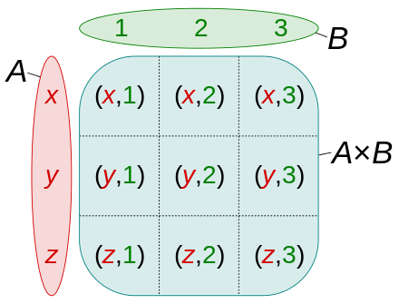
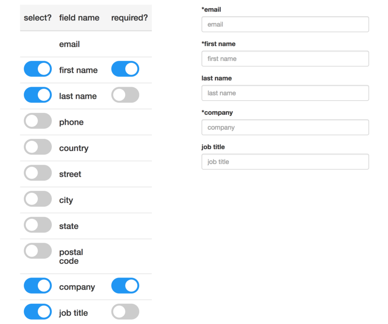

## Algebraic Data Types

<br />
<br />
<br />
> by Giorgi Bagdavadze / @notgiorgi

---

## Product Types

```ts
class Pair<U, V> {
    constructor(
        x: U,
        y: V,
    ) { /*...*/ }
}
```

```haskell
data Pair u v = Pair u v
```

Note: Products of types represent a conjunction, “and,” of those types.

<===>

```ts
class Person {
  constructor(
    name: String,
    age: Number,
    address: String,
  ) { /* ... */ }
}

class Box<T> {
  constructor(private value: T) { }
  /* ... */ 
}
```

```haskell
data Person = Person
  { name    :: String
  , age     :: Int
  , address :: String
  }

data Box a = Box a
```

<===>

## Intiution of haskell

```ts
class Pair<U, V> {
    constructor(x: U, y: V) { }
}

let pair = new Pair<boolean, string>(false, "Foo")
```

```haskell
data Pair u v = Pair u v
--   ^ Type     ^ Constructor

-- Type
pair :: Pair Bool String
-- Value
pair = Pair False "Foo"
```

<===>

### Why Algebraic? Why Product?

<===>

### Symmetrical

`a * b == b * a`

```ts
Pair<U,V> ~~ Pair<V, U>
Pair<boolean, string> ~~ Pair<string, boolean>
```

```haskell
Pair u v ~~ Pair v u
Pair Bool String ~~ Pair String Bool
```

Note: You could say, this is a mathematical proof, that the order you define members of your data structure in, doesn’t matter.

<===>

### Isomorphism

```haskell
to   :: A -> B
from :: B -> A
```

```ts
to(from(x)) == x == from(to(x))
```


```ts
function swap<U, V>(pair: Pair<U, V>): Pair<V, U> {
  return new Pair<V, U>(pair.y, pair.x)
}
```

<===>

### Associative

`a * (b * c) == (a * b) * c == a * b * c`

```csharp
Pair<Pair<U, V>, W>
~~
Pair<U, Pair<V, W>>
~~
Triplet<U, V, W>
```

```
Pair u (Pair v w) ~~ Pair (u Bool v) w
```

<===>

### Identity

`a * 1 == a == 1 * a`

```ts
Pair<T, Unit> ~~ T
```


```haskell
Pair T Unit ~~ Bool
```

Note: Describe Unit

<===>

## Cartesian Product



---

## Sum (Union) Types

```ts
enum PromiseState = {
  Pending,
  Fulfilled,
  Rejected,
}
```

```haskell
data PromiseState = Pending | Fulfilled | Rejected
```

<===>

## More than just enums

```ts
interface Optional<T> {/* ... */}
class Some<T> implements Optional<T> {/* .. */}
class None<T> implements Optional<T> {/* ... */}

interface List<T> {/* ... */}
class Nil<T> implements List<T> {/* ... */}
class Cons<T> implements List<T> {/* ... */}
```

```haskell
data Optional a = Some a | None

data List a = Nil | Cons a (List a)

data Promise u v
  = Pending (Array Listener)
  | Rejected (Array Listener) u
  | Fulfilled (Array Listener) v
```

<===>

## Symmetrical

`a + b == b + a`

```ts
Result<Response, string> ~~ Result<string, Response>
```

```haskell
Result Response String ~~ Result String Response
```

<===>

## Associative

`(a + b) + c == a + (b + c)`

```ts
Result<Result<DBError, Response>, number>
~~
Result<DBError, Result<Response, number>>
```

```haskell
Result (Result<DBError Response) Int
~~
Result<DBError (Result Response Int)
```

<===>

## Identity

`a + 0 = a = 0 + a`

```ts
class Foo { /* ... */ }

class Void {
  private Void() {/* ... */}
}

Result<Foo, Void> ~~ Foo
```

```haskell
Foo a | Void ~~ Foo a
```

<===>

## Union


---

```ts
class Pending<U,V> implements Promise<U, V> {
  constructor(
    private listeners: Array<Listener>
  ) { }
}

class Rejected<U, V> implements Promise<U, V> {
  constructor(
    private listeners: Array<Listener>,
    err: U
  ) { }
}

class Fulfilled<U, V> implements Promise<U, V> {
  constructor(
    private listeners: Array<Listener>,
    value: V
  ) { }
}
```

```haskell
data Promise u v
  = Pending (Array Listener)
  | Rejected (Array Listener) u
  | Fulfilled (Array Listener) v
```

<===>

## Distributive property

`a * x + c * x == x * (a + b)`

```ts
type PromiseState<U, V> = Pending | Rejected<U> | Fulfilled<V>

class Promise<U, V> {
  constructor(
    private listeners: Array<Listener>,
    private state: PromiseState<U, V>
  )
}
```

```haskell
data PromiseState a b
    = Pending
    | Rejected a
    | Fulfilled b

data Promise a b = Promise (Array Listener) (PromiseState a b)
```

---

## Expotential (Function) Type

a → b ~~ b<sup>a</sup>

```ts
function f(p: PromiseState): Boolean {/* ... */}
```

```haskell
f :: PromiseState -> Bool
```

<===>

a<sup>b</sup> * a<sup>c</sup> == a<sup>b + c</sup>

```ts
interface PromiseStates<U, V> {
    /* ... */
    then<W>(
      onFulfill: (value: U) => W,
      onReject: (error: V) => W
    ): W

    // ~~

    then<W>(
      handler: (valueOrError: Result<U, V>) => W
    ): W
}
```

```haskell
Pair (b -> a) (c -> a) ~~ Result b c -> a
```

<===>

c<sup>(a * b)</sup> == (c<sup>a</sup>)<sup>b</sup>

```ts
function f(a: U, b: V): W
~~
function f(a: U): ((b: V) => W)
```

```haskell
f :: Pair u v -> w
~~
f :: u -> v -> w
```

---

## Flags

```ts
type YesNo<T> = Yes<T> | No<T>

Pair<string, boolean> ~~ YesNo<string>

new Pair("barrab", true) ~~ new Yes("barrab")
new Pair("foo", false) ~~ new No("foo")
```

```haskell
data YesNo a = Yes a | No a

Pair String Bool ~~ YesNo String
```

---

## Declare with Invariants!


<===>

## Naive approach

```ts
class Node<T> {
  constructor(
    left: Node,
    value: T,
    right: Node,
  ) { }
}
```

```haskell
data Node a = Node (Optional (Node a)) (Optional a) (Optional (Node a))

depth :: Node a -> Int
depth (Node left value right) =
  case left of
    None   -> ...
    Some a ->
      case right of
        None -> ...
        ...
```

<===>

## Declare with Invariants!

```ts
type Tree<T> = Empty<T> | Leaf<T> | Node<T>
```

```haskell
data Tree a
  = Empty
  | Leaf a
  | Node Tree Tree

depth :: Tree -> Int
depth Empty = 0
depth (Leaf n) = 1
depth (Node l r) = 1 + max (depth l) (depth r)
```

Note: Defining data structure in such a way using only type system, that you cannot construct an instance of that type that violates that invariant

---



<===>

```haskell
data Field = Field String SelectionStatus

data SelectionStatus
    = Sealed
    | Unselected
    | Selected FieldRequirement

data FieldRequirement
    = Required
    | Optional
```

<===>

- No invalid states
- You won't forget edge cases
- Compiler is your friend

---

## Recursive Types

```tex
L(a) = 1 + (a * L(a))
     = 1 + a * (1 + a * L(a))
     = 1 + a + (a * a * L(a))
     = ...
```

```ts
interface List<T> {/*...*/}
class Nil<T> implements List<T> {/* ... */}
class Cons<T> implements List<T> {/* ... */}

let l: List<Number> =
  new Cons(3,
    new Cons(4,
      new Nil()
    )
  )
// 3 -> 4 -> Nil
```

```haskell
--            1   +      1 * L(x)
data List a = Nil | Cons a (List a)
```

---

## if (x != null) - Bad

```ts
class Vector {
  /* ... */
  divide(that: Vector): Vector {
    if (that.x !== 0 || that.y !== 0)
      return new Vector(this.x / that.x, thix.y / that.y)
    return null
  }
}

/* ... */
const v3 = v1.divide(v2)
if (v3 !== null) {
  v3.add(/* ... */)
}
```
<===>

## Better

```ts
interface Vector {/* ... */}

class FullVector implements Vector{
  divide(that: Vector): Vector {
    if (that.x !== 0 || that.y !== 0)
      return new FullVector(this.x / that.x, thix.y / that.y)
    return new NullVector()
  }
  render() {/* ... */}
}

class NullVector implements Vector {
  divide(that: Vector): Vector { return this }
  render() {/* ... */}  
}

const v3 = v1
  .divide(v2)
  .add(v5)
  .render()
```

<===>

## The best

```ts
type Optional<T> = Some<T> | None

class Vector {
  divide(that: Vector): Optional<Vector> {
    if (that.x !== 0 || that.y !== 0)
      return new Some(
        new Vector(this.x / that.x, thix.y / that.y)
      )
    return new None()
  }
}


const v3 = v1
  .divide(v2)
  .chain(v => v.multiply(2))
  .matchCase(
    v => console.log(v.x, v.y),
    () => console.log('Error')
  )
```

---

# Thanks!

<br />
<br />

> ¿Questions?
